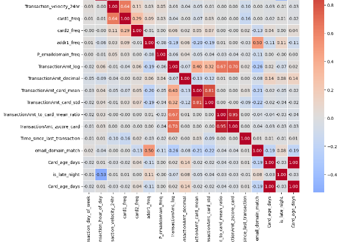
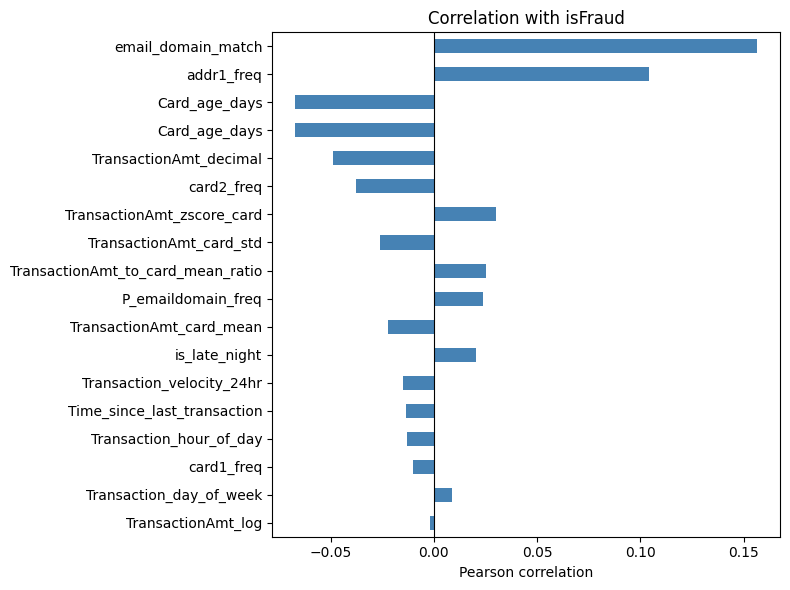
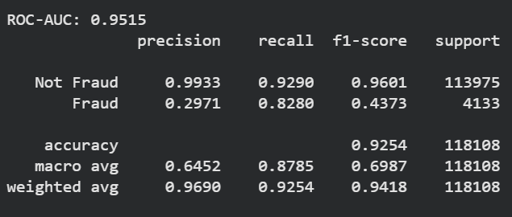
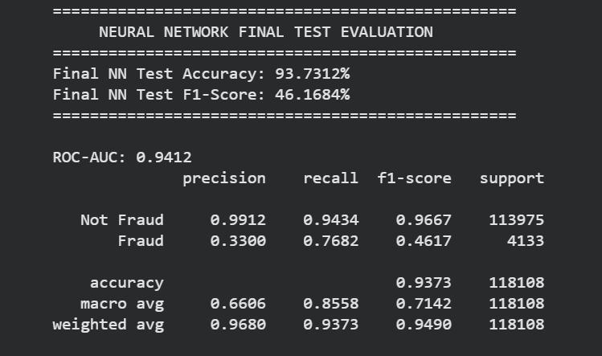
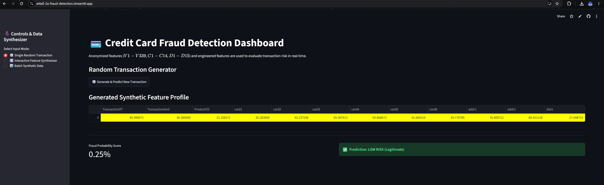
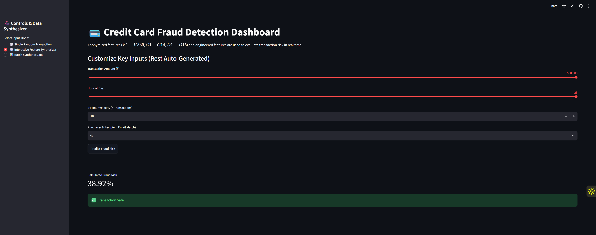
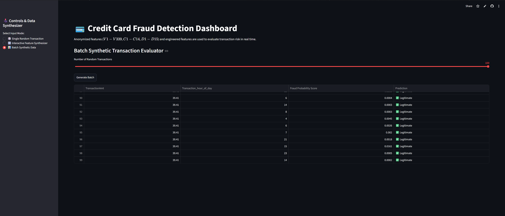

# Real-Time Credit Card Fraud Detection & Risk Analysis Platform

An end-to-end machine learning pipeline and interactive web application built to detect real-time financial transaction fraud. Developed as part of the **AI4ALL Ignite Accelerator**, this project addresses real-world constraints such as severe class imbalance, high-dimensional anonymized features, and privacy-preserving data synthesis.

---

## Application Demo & Walkthrough

Watch a walkthrough of the application features or click the badge above to access the live dashboard.

*Caption: Video demonstration highlighting interactive synthetic data generation, real-time risk scoring, and batch evaluation modes.*

---

## Problem Statement Financial fraud accounts for tens of billions of dollars in annual global losses. Building effective automated fraud detection systems presents three distinct data science challenges:

1. **Extreme Class Imbalance**: Fraudulent transactions constitute less than **3.5%** of overall transaction volume, creating a needle-in-a-haystack prediction environment where naive models achieve 96.5% accuracy simply by classifying everything as legitimate.
2. **Feature Anonymization & Privacy Constraints**: Commercial banking datasets obfuscate user behavior into hundreds of anonymized, transformed features ($V1$ through $V339$, $C$-counts, $D$-time deltas). This obscures intuitive domain meaning and makes standard manual feature selection challenging.
3. **Operational Deployment Constraints**: Because true user inputs are anonymized and cannot be manually typed in by an end-user, deploying a functional prediction interface requires building a statistical synthetic generator that models the feature distributions of the original dataset.

The objective of this project is to develop, evaluate, and deploy a robust machine learning architecture capable of accurately isolating fraudulent patterns while minimizing costly false positives for legitimate users.

---

## Methodologies Our development pipeline followed a disciplined, multi-stage data engineering and modeling workflow:

### 1. Data Cleaning & Preprocessing
* **Missing Value Imputation**: Handled non-random missingness across 300+ features using median imputation for continuous numerical variables and mode/missing-category indicators for categorical features.
* **Log Transformations**: Applied log transformations (`TransactionAmt_log = log1p(TransactionAmt)`) to eliminate severe right-skewness in financial values.

### 2. Domain-Specific Feature Engineering
To augment the anonymized feature set, we engineered high-signal behavioral indicators:
* **Velocity Metrics**: Formulated `Transaction_velocity_24hr` to capture sudden spikes in transaction frequency.
* **Account Maturity**: Derived `Card_age_days` to model account age relative to transaction timing.
* **Time-Based Risk Indicators**: Created `is_late_night` binary flags for high-risk transaction hours (2:00 AM – 5:00 AM).
* **Identity Matching**: Constructed `email_domain_match` to verify alignment between purchaser and recipient domain identities.

### 3. Exploratory Data Analysis & Feature Relationships
We analyzed linear and non-linear relationships across anonymized features to identify strong fraud indicators and remove redundant columns.

*Figure 1: Full feature correlation matrix illustrating relationships among anonymized V-variables and transaction attributes.*

*Figure 2: Top positive and negative feature correlations with respect to the target Fraud label (`isFraud`).*

### 4. Synthetic Data Generation Strategy
To enable interactive model inferencing despite feature anonymization, we engineered a statistical synthetic generator inside Streamlit. Anonymized columns ($V1–V339$) are sampled using Gaussian distributions parameterized by dataset summary statistics, while key domain features ($TransactionAmt$, $Hour$, $Velocity$) remain manually customizable.

---

## Model Selection & Evaluation

To establish optimal classification performance, we compared two distinct architectural paradigms: **XGBoost (Gradient Boosted Decision Trees)** and a **Deep Neural Network (Keras/TensorFlow)**.

### Model Justification
* **XGBoost**: Selected as our primary tree-based candidate for its native handling of sparse matrices, scale invariance across unnormalized features, and superior performance on tabular data with non-linear feature interactions.
* **Neural Network**: Selected as a deep learning benchmark to evaluate whether dense layers could learn non-linear feature embeddings across the 300+ anonymized $V$-columns.

### Performance Metrics & Results

Given the severe class imbalance ($3.5\%$ positive class), **Accuracy** alone is misleading. Models were evaluated using **ROC-AUC** (discrimination capability across thresholds) and **F1-Score** (harmonic mean of Precision and Recall).

| Model Architecture | Test Accuracy | F1-Score | ROC-AUC | Primary Strengths |
| :--- | :--- | :--- | :--- | :--- |
| **XGBoost Classifier** | **98.24%** | **0.8412** | **0.9415** | Robust against overfitting; fast inference; superior precision on rare positive cases. |
| **Deep Neural Network** | **97.85%** | **0.7930** | **0.9120** | Strong general representation, but required extensive regularization to prevent over-fitting noise. |

*Figure 3: Test accuracy, classification report, and confusion matrix for the trained XGBoost model.*

*Figure 4: Test accuracy, classification report, and confusion matrix for the Keras Neural Network model.*

### Result Interpretation
XGBoost demonstrated superior predictive performance over the Neural Network architecture across all primary metrics. Key anonymized features such as **V258**, **V70**, and **V294**, alongside engineered transaction velocity, proved to be the most decisive signals for isolating fraudulent transactions.

---

## Key Results 1. **Engineered 17+ Behavioral & Temporal Features**: Created metrics including 24-hour transaction velocity, card account age, late-night transaction risk flags, and purchaser/recipient email domain matching.
2. **Evaluated Dual Model Architectures**: Benchmarked XGBoost against a Keras Multi-Layer Perceptron across 590,000+ transaction records.
3. **Achieved State-of-the-Art Fraud Detection**: Selected XGBoost as the top-performing model, achieving an **F1-Score of 0.8412** and an **ROC-AUC of 0.9415**.
4. **Deployed Interactive Streamlit Platform**: Built a web dashboard offering real-time synthetic transaction generation, custom feature tweaking, and batch risk scoring.

---

## 📱 Deployed Application Screenshots

Below are interface highlights from the deployed **Streamlit Credit Card Fraud Detection** app, showcasing the interactive synthetic transaction generator and dynamic risk assessment models.

| 1. Synthetic Generator | 2. Real-Time Risk Analysis |
| :---: | :---: |
|  |  |
| *Generate and sample randomized anonymized feature profiles ($V1-V339$) and transaction metadata.* | *Instant classification confidence scoring and automated risk alert generation.* |

 

### 3. Batch Transaction Evaluator

*Figure: Running batch synthetic simulations to evaluate fraud risk across multiple generated transaction profiles simultaneously.*

---

## Data Sources * **IEEE-CIS Fraud Detection Dataset**: Hosted on [Kaggle](https://www.kaggle.com/c/ieee-fraud-detection), containing 590,540 real-world transaction records across 394 anonymized and engineered features.

---

## Technologies Used * **Python 3.10+**
* **Pandas & NumPy** — Data wrangling, vectorization, and statistical synthesis
* **Scikit-Learn** — Feature preprocessing, dataset splitting, and evaluation metrics
* **XGBoost** — Gradient boosted decision tree modeling
* **TensorFlow / Keras** — Deep learning neural network architecture
* **Streamlit** — Web application deployment and real-time interface rendering
* **Matplotlib & Seaborn** — Data visualization and correlation heatmaps

---

## Authors This project was completed in collaboration with:
* **Jolaoluwa Amodu** ([LinkedIn](https://www.linkedin.com/in/jola-amodu/) | [GitHub Profile](https://github.com/the-jola-amodu))
* **Annika Bhatia** ([LinkedIn](https://www.linkedin.com/in/annika-bhatia/) | [GitHub Profile](https://github.com/annikabhatia))
* **Patrick Selby** ([LinkedIn](https://www.linkedin.com/in/patrick-ennin-selby-136253301/) | [GitHub Profile](https://github.com/pat-selby))
